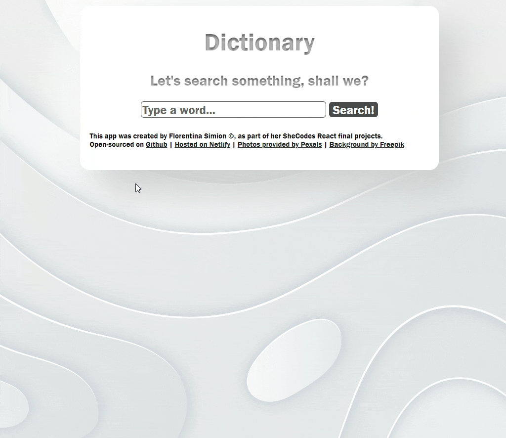

# 📚 Flo's Interactive Dictionary App

Welcome! This repository houses the code for an interactive dictionary application. Designed with simplicity in mind, it aims to make word lookup not just informative, but also visually pleasing.

## 🎯 What's the Objective?

This app serves a straightforward purpose:

- To provide quick and reliable definitions for words.
- To offer visual context through images.
- To maintain a user-friendly interface for an improved user experience.

## 🛠️ Built With

For this project, I opted for a minimal yet powerful tech stack:

## 📡 APIs Used

- **Dictionary API**: For fetching word definitions.
- **Pexels API**: For fetching relevant images.

## 🌈 Highlighted Features

### 📖 Instant Definitions
Look up definitions on the fly, without any fuss.

### 🖼️ Visual Context
Images related to the word you're searching for are displayed, offering more than just a textual explanation.

### 🌐 User-Friendly Interface
Designed to be intuitive and minimal, enhancing user engagement.

## 🚀 Live Demo

Curious to see it in action? [Check out the live demo!](https://dictionary-project-flo.netlify.app/)

## 📣 Final Words

This Dictionary App is one of the ways I enjoy blending functionality with design. Whether you're here to explore the code or to find a useful tool, I hope you find what you're looking for!

---

Feel free to explore the code, raise issues, and provide feedback. Cheers!
